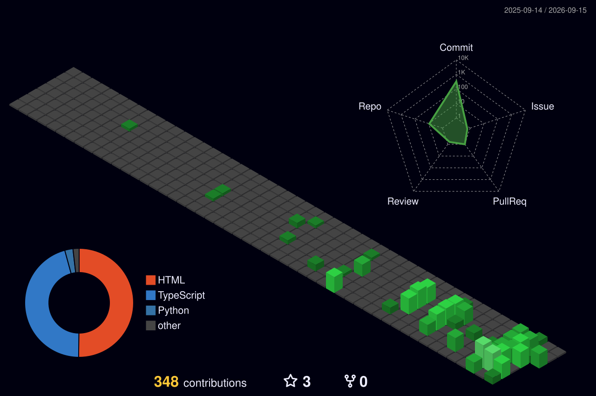

  

 

<h1 align="left">
  Hey Folks 
   
  I'm Cássio Antônio 👋
</h1>

- 👨‍💻 Full Stack Developer
- 🎓 Bacharel em **Ciência da Computação**
- 🚀 Transformando ideias em aplicações modernas, escaláveis e funcionais
- 📍   **Passos Minas Gerais, Brasil**
- ⚛️ Experiência em **React, TypeScript, Next.js e Node.js**
- 🧠 Sempre aprendendo, construindo e evoluindo
- 💬 Aberto a networking, projetos e novas oportunidades

---

## 🛠️ Tech Stack

---

## 💻 About Me

I'm a **Computer Science graduate and Full Stack Developer** focused on building modern web and mobile applications.

I work mainly with the **JavaScript/TypeScript ecosystem**, developing interfaces, APIs, integrations and complete applications.

My goal is to write **clean, reusable and scalable code**, while continuously improving my technical skills and creating solutions that generate real value.

---

## 🚀 What I Work With

| Frontend | Backend | Database | Tools |
|:---:|:---:|:---:|:---:|
| React | Node.js | PostgreSQL | Git |
| Next.js | NestJS | Supabase | GitHub |
| React Native | Express | MariaDB | GitHub Actions |
| TypeScript | REST APIs | MySQL | Vercel |
| Tailwind CSS | Python |  | VS Code |

---

## 📊 GitHub Analytics

 

---

## 🔗 Connect With Me

---

### 💻 Code. Learn. Build. Evolve. 🚀

